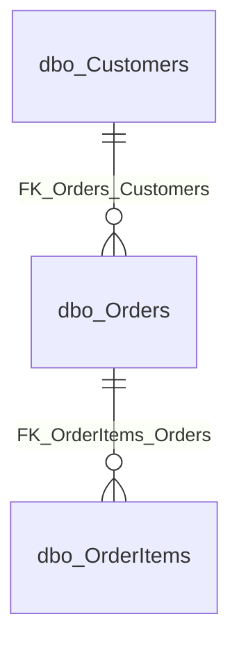

# ER-Modell Generator for SQL Server

Dette prosjektet inneholder PowerShell-script som kobler til en SQL Server database og genererer Entity-Relationship (ER) modeller, tabellstatistikk og identifiserer døde tabeller.

## 📋 Innholdsfortegnelse

- [Oversikt](#-oversikt)
- [Script](#-script)
- [Funksjoner](#-funksjoner)
- [Forutsetninger](#-forutsetninger)
- [Installasjon](#-installasjon)
- [Konfigurasjon](#-konfigurasjon)
- [Bruk](#-bruk)
- [Utdata](#-utdata)
- [Feilsøking](#-feilsøking)
- [Eksempler](#-eksempler)

## 📌 Oversikt

Prosjektet består av **tre hovedscript** som jobber sammen:

1. **GetTableStatistics.ps1** - Henter statistikk for alle tabeller
2. **CreateErModelFromSql.ps1** - Genererer ER-modeller
3. **FilterDeadTables.ps1** - Identifiserer døde tabeller og lager filtrerte modeller

## 📜 Script

### 1. GetTableStatistics.ps1
Henter statistikk for alle tabeller i databasen:
- Antall records per tabell
- Siste aktivitet (opprett/endret-dato)
- Identifiserer tomme tabeller
- Output: `table-statistics.csv`

### 2. CreateErModelFromSql.ps1
Genererer ER-modeller fra database:
- Full modell med alle detaljer (kolonner, datatyper, relasjoner)
- Forenklet modell med kun tabellnavn og relasjoner
- Output: `schema.full.mmd`, `schema.simple.mmd`

### 3. FilterDeadTables.ps1
Kombinerer statistikk med ER-modell:
- Identifiserer døde tabeller (ingen records eller ingen aktivitet)
- Genererer CSV med døde tabeller
- Lager filtrert ER-modell med kun aktive tabeller
- Output: `dead-tables.csv` (i prosjektrot), `erd/filtered/schema-active-only.mmd`

## ✨ Funksjoner

Prosjektet genererer følgende output:

### 1. **Tabellstatistikk** (`table-statistics.csv`)
- Antall records per tabell
- Siste aktivitet (opprett/endret-dato)
- Identifiserer tomme tabeller
- For videre analyse og rapportering

### 2. **Mermaid Full Modell** (`erd/schema.full.mmd`)
- **Komplett visning** med alle detaljer
- Viser alle tabeller med kolonner
- Inkluderer datatyper (varchar(50), int, decimal(10,2), etc.)
- Markerer primærnøkler (PK)
- Viser alle relasjoner (fremmednøkler) med kardinalitet
- Støtter nullable vs. påkrevde relasjoner

### 3. **Mermaid Forenklet Modell** (`erd/schema.simple.mmd`)
- **Oversiktsvisning** for rask forståelse
- Viser kun tabellnavn
- Viser relasjoner mellom tabeller
- Ideell for presentasjoner og høynivå-dokumentasjon

### 4. **Døde Tabeller** (`dead-tables.csv`)
- Liste over tabeller uten records
- Tabeller uten aktivitet siste periode
- For opprydding og databaseoptimalisering

### 5. **Filtrert ER-Modell** (`erd/filtered/schema-active-only.mmd`)
- Forenklet Mermaid-modell med kun aktive tabeller
- Fjerner døde tabeller fra visningen
- Gir en ren oversikt over databasen i bruk

## 📦 Forutsetninger

### Systemkrav
- **Windows PowerShell 5.1** eller nyere
- **PowerShell Core 7+** (anbefalt for cross-platform)
- **SQL Server** (lokal eller remote instans)
- Tilgang til SQL Server database med lesehensikt

### PowerShell Moduler
- **SqlServer** modul (installeres automatisk ved kjøring hvis mangler)

## 🔧 Installasjon

### 1. Last ned scriptet
```powershell
# Naviger til ønsket mappe
cd "C:\Scripts"

# Scriptet ligger nå i mappen
```

### 2. Installer SqlServer modul (hvis ikke allerede installert)
```powershell
Install-Module -Name SqlServer -Scope CurrentUser -Force
```

### 3. Konfigurer miljøvariabler
```powershell
# Kopier template-filen til .env
Copy-Item .env.template .env

# Rediger .env filen med dine database-detaljer
notepad .env
```

## ⚙️ Konfigurasjon

### Bruke .env fil (Anbefalt)

Scriptet støtter miljøvariabler via en `.env` fil for sikker håndtering av tilkoblingsdetaljer.

1. **Kopier template-filen:**
   ```powershell
   Copy-Item .env.template .env
   ```

2. **Rediger `.env` filen:**
   ```ini
   # SQL Server tilkobling
   DB_SERVER_INSTANCE=localhost\SQLEXPRESS
   DB_DATABASE=MinDatabase
   
   # SQL Autentisering (valgfritt)
   # DB_USERNAME=sa
   # DB_PASSWORD=MittPassord123!
   
   # Utdata konfigurasjon (valgfritt)
   # OUTPUT_DIR=.\erd
   # SCHEMA_FILTER=dbo,sales,hr
   # LOG_LEVEL=INFO
   ```

3. **Legg til `.env` i `.gitignore`** (viktig!):
   ```gitignore
   .env
   *.log
   erd/
   ```

### Konfigurasjonsverdier

| Variabel | Beskrivelse | Påkrevd | Eksempel |
|----------|-------------|---------|----------|
| `DB_SERVER_INSTANCE` | SQL Server instans | ✅ Ja | `localhost\SQLEXPRESS`, `myserver.database.windows.net` |
| `DB_DATABASE` | Database navn | ✅ Ja | `Northwind`, `AdventureWorks` |
| `DB_USERNAME` | SQL brukernavn | ⬜ Nei | `sa`, `dbuser` |
| `DB_PASSWORD` | SQL passord | ⬜ Nei | `MyP@ssw0rd!` |
| `OUTPUT_DIR` | Utdata mappe | ⬜ Nei | `.\erd` (standard) |
| `SCHEMA_FILTER` | Kommaseparert liste over schema | ⬜ Nei | `dbo,sales,hr` |
| `LOG_LEVEL` | Logging nivå | ⬜ Nei | `DEBUG`, `INFO`, `WARNING`, `ERROR` |

**Merk:** Hvis `DB_USERNAME` og `DB_PASSWORD` ikke er satt, brukes Windows/Azure AD autentisering.

## 🚀 Bruk

### Komplett Arbeidsflyt

For å få komplett oversikt over databasen, kjør scriptene i denne rekkefølgen:

```powershell
# Steg 1: Hent tabellstatistikk
.\GetTableStatistics.ps1 -UseEnvFile

# Steg 2: Generer ER-modeller
.\CreateErModelFromSql.ps1 -UseEnvFile

# Steg 3: Filtrer ut døde tabeller og lag ren modell
.\FilterDeadTables.ps1
```

### Quick run (nåværende oppsett)

```powershell
# Fra prosjektroten: PS Script/CreateErModelFromSql
.\GetTableStatistics.ps1 -UseEnvFile -OutputFile ".\table-statistics.csv"
.\CreateErModelFromSql.ps1 -UseEnvFile
.\FilterDeadTables.ps1 -StatisticsFile ".\table-statistics.csv" -MermaidFile ".\erd\schema.simple.mmd" -OutputDir ".\erd\filtered"
```

Forventet output:
- `table-statistics.csv` (rot)
- `dead-tables.csv` (rot)
- `erd/schema.full.mmd`
- `erd/schema.simple.mmd`
- `erd/filtered/schema-active-only.mmd`

### Script 1: GetTableStatistics.ps1

**Med .env fil (Anbefalt):**
```powershell
.\GetTableStatistics.ps1 -UseEnvFile
```

**Med kommandolinje-parametere:**
```powershell
# Grunnleggende bruk
.\GetTableStatistics.ps1 -ServerInstance "localhost\SQLEXPRESS" -Database "Northwind"

# Med SQL autentisering
$cred = Get-Credential
.\GetTableStatistics.ps1 `
    -ServerInstance "myserver.database.windows.net" `
    -Database "ProductionDB" `
    -SqlCredential $cred `
    -OutputFile ".\stats.csv"
```

### Script 2: CreateErModelFromSql.ps1

**Med .env fil (Anbefalt):**
```powershell
.\CreateErModelFromSql.ps1 -UseEnvFile
```

**Med kommandolinje-parametere:**
```powershell
# Grunnleggende bruk med Windows autentisering
.\CreateErModelFromSql.ps1 -ServerInstance "localhost\SQLEXPRESS" -Database "Northwind"

# Med schema filter
.\CreateErModelFromSql.ps1 `
    -ServerInstance "localhost\SQLEXPRESS" `
    -Database "AdventureWorks" `
    -SchemaFilter @("Sales", "Production", "HumanResources") `
    -OutputDir ".\erd"
```

### Script 3: FilterDeadTables.ps1

**Grunnleggende bruk:**
```powershell
# Bruker standardverdier
.\FilterDeadTables.ps1
```

**Med egendefinerte filer:**
```powershell
.\FilterDeadTables.ps1 `
    -StatisticsFile ".\table-statistics.csv" `
    -MermaidFile ".\erd\schema.simple.mmd" `
    -OutputDir ".\erd\filtered" `
    -MinRowCount 1
```

### Parametere

#### GetTableStatistics.ps1
| Parameter | Type | Beskrivelse | Standard |
|-----------|------|-------------|----------|
| `-ServerInstance` | string | SQL Server instans | - |
| `-Database` | string | Database navn | - |
| `-SqlCredential` | PSCredential | Legitimasjon for SQL autentisering | - |
| `-OutputFile` | string | CSV-fil for output | `.\table-statistics.csv` |
| `-SchemaFilter` | string[] | Schema å inkludere | `@()` (alle) |
| `-LogLevel` | string | Logging nivå (DEBUG/INFO/WARNING/ERROR) | `INFO` |
| `-UseEnvFile` | switch | Bruk .env fil for konfigurasjon | - |

#### CreateErModelFromSql.ps1
| Parameter | Type | Beskrivelse | Standard |
|-----------|------|-------------|----------|
| `-ServerInstance` | string | SQL Server instans | - |
| `-Database` | string | Database navn | - |
| `-SqlCredential` | PSCredential | Legitimasjon for SQL autentisering | - |
| `-OutputDir` | string | Utdata mappe | `.\erd` |
| `-SchemaFilter` | string[] | Schema å inkludere | `@()` (alle) |
| `-LogLevel` | string | Logging nivå (DEBUG/INFO/WARNING/ERROR) | `INFO` |
| `-UseEnvFile` | switch | Bruk .env fil for konfigurasjon | - |

#### FilterDeadTables.ps1
| Parameter | Type | Beskrivelse | Standard |
|-----------|------|-------------|----------|
| `-StatisticsFile` | string | Input CSV med tabellstatistikk | `.\table-statistics.csv` |
| `-MermaidFile` | string | Input Mermaid ERD-fil | `.\erd\schema.simple.mmd` |
| `-OutputDir` | string | Utdata mappe for filtrert ER-modell | `.\erd\filtered` |
| `-MinRowCount` | int | Minimalt antall rader for å være "aktiv" | `1` |

`dead-tables.csv` skrives alltid i samme mappe som `-StatisticsFile`.

## 📤 Utdata
### Output fra GetTableStatistics.ps1

#### `table-statistics.csv`
```csv
SchemaName,TableName,FullName,TableRowCount,LastActivityDate,IsEmpty,LastWeek
dbo,Customers,dbo.Customers,1234,2026-02-15 10:35:00,False,True
dbo,Orders,dbo.Orders,5678,2026-02-17 08:10:00,False,True
dbo,OldTable,dbo.OldTable,0,2024-11-20 14:22:00,True,False
```

### Output fra CreateErModelFromSql.ps1

#### 1. `erd/schema.full.mmd` - Mermaid Full Modell

```mermaid
erDiagram
  dbo_Customers {
    int CustomerID PK
    nvarchar(50) CustomerName
    nvarchar(100) Email
    datetime CreatedDate
  }
  dbo_Orders {
    int OrderID PK
    int CustomerID
    decimal(10,2) TotalAmount
    datetime OrderDate
  }
  dbo_Customers ||--o{ dbo_Orders : "FK_Orders_Customers"
```

**Bruk:**
- Lim inn i [Mermaid Live Editor](https://mermaid.live/)
- Bruk i Markdown dokumenter (GitHub, Azure DevOps, etc.)
- Generer bilder med Mermaid CLI

#### 2. `erd/schema.simple.mmd` - Mermaid Forenklet Modell



**Bruk:**
- Oversiktsdiagrammer i presentasjoner
- Hurtig forståelse av databasestruktur
- Dokumentasjon på høyt nivå

### Output fra FilterDeadTables.ps1

#### 1. `dead-tables.csv` (i prosjektrot)
```csv
SchemaName,TableName,FullName,TableRowCount
dbo,OldTable,dbo.OldTable,0
dbo,DeprecatedData,dbo.DeprecatedData,0
```

#### 2. `erd/filtered/schema-active-only.mmd`
Filtrert Mermaid-modell med kun aktive tabeller (tabeller med data).

### Logging

Alle script logger til:
- `er-model-generator.log` (CreateErModelFromSql.ps1)
- Console output med farget status

## 🔍 Feilsøking

### Problem: SqlServer modul ikke funnet

**Feilmelding:**
```
SqlServer-modulen er ikke installert
```

**Løsning:**
```powershell
Install-Module -Name SqlServer -Scope CurrentUser -Force
Import-Module SqlServer
```

### Problem: Kan ikke koble til database

**Feilmelding:**
```
Kan ikke koble til database: Login failed for user...
```

**Løsning:**
1. Sjekk at server instance navnet er korrekt
2. Verifiser brukernavn/passord (hvis SQL autentisering)
3. Sjekk at Windows autentisering er aktivert (hvis ikke bruker SQL auth)
4. Verifiser at SQL Server tillater remote tilkoblinger
5. Sjekk firewall-innstillinger

### Problem: Ingen tabeller funnet

**Feilmelding:**
```
Ingen tabeller funnet i databasen
```

**Løsning:**
1. Sjekk at database-navnet er korrekt
2. Verifiser at brukeren har leserettigheter
3. Sjekk `SchemaFilter` - prøv uten filter
4. Verifiser at databasen har tabeller (ikke bare views)

### Problem: .env fil ikke lest

**Løsning:**
1. Sjekk at `.env` filen ligger i samme mappe som scriptet
2. Verifiser at filen heter `.env` (ikke `.env.txt`)
3. Bruk `-UseEnvFile` parameteren
4. Kjør med `-LogLevel DEBUG` for å se hva som leses

### Debug Tips

```powershell
# Kjør med debug logging for detaljert informasjon
.\CreateErModelFromSql.ps1 -UseEnvFile -LogLevel DEBUG

# Sjekk loggfilen
Get-Content .\er-model-generator.log -Tail 50

# Test database-tilkobling manuelt
Invoke-Sqlcmd -ServerInstance "localhost\SQLEXPRESS" -Database "master" -Query "SELECT @@VERSION"
```

## 📚 Eksempler

### Eksempel 1: Komplett arbeidsflyt (lokalt SQL Server)

```powershell
# .env innhold
DB_SERVER_INSTANCE=localhost\SQLEXPRESS
DB_DATABASE=Northwind

# Steg 1: Hent tabellstatistikk
.\GetTableStatistics.ps1 -UseEnvFile

# Steg 2: Generer ER-modeller
.\CreateErModelFromSql.ps1 -UseEnvFile

# Steg 3: Filtrer døde tabeller
.\FilterDeadTables.ps1
```

**Resultat:**
```
✓ table-statistics.csv - Statistikk for alle 45 tabeller
✓ erd/schema.full.mmd - Full ER-modell med alle detaljer
✓ erd/schema.simple.mmd - Forenklet ER-modell
✓ erd/filtered/dead-tables.csv - 12 døde tabeller identifisert
✓ erd/filtered/schema-active-only.mmd - ER-modell med 33 aktive tabeller
```

### Eksempel 2: Azure SQL Database med SQL Autentisering

```powershell
# .env innhold
DB_SERVER_INSTANCE=myserver.database.windows.net
DB_DATABASE=ProductionDB
DB_USERNAME=sqladmin
DB_PASSWORD=SuperSecure123!
OUTPUT_DIR=.\erd
LOG_LEVEL=INFO

# Kjør alle script
.\GetTableStatistics.ps1 -UseEnvFile
.\CreateErModelFromSql.ps1 -UseEnvFile
.\FilterDeadTables.ps1
```

### Eksempel 3: Kun spesifikke schema

```powershell
# .env innhold
DB_SERVER_INSTANCE=localhost\SQLEXPRESS
DB_DATABASE=AdventureWorks
SCHEMA_FILTER=Sales,Production,HumanResources

# Kjør statistikk og ER-modell for spesifikke schema
.\GetTableStatistics.ps1 -UseEnvFile
.\CreateErModelFromSql.ps1 -UseEnvFile
.\FilterDeadTables.ps1
```

### Eksempel 4: Automatisering med Task Scheduler

Lag en `.ps1` fil for automatisk generering:

```powershell
# GenerateERD-Daily.ps1
Set-Location "C:\Scripts\CreateErModelFromSql"

# Kjør alle tre script
.\GetTableStatistics.ps1 -UseEnvFile
.\CreateErModelFromSql.ps1 -UseEnvFile
.\FilterDeadTables.ps1

# Send e-post med vedlegg (valgfritt)
Send-MailMessage `
    -To "db-team@example.com" `
    -From "automation@example.com" `
    -Subject "Database ER-modeller - $(Get-Date -Format 'yyyy-MM-dd')" `
    -Body "Vedlagt er dagens ER-modeller og døde tabeller" `
    -Attachments ".\erd\filtered\dead-tables.csv",".\table-statistics.csv" `
    -SmtpServer "smtp.example.com"
```

Opprett en scheduled task i Windows:
```powershell
$action = New-ScheduledTaskAction -Execute "powershell.exe" -Argument "-File C:\Scripts\GenerateERD-Daily.ps1"
$trigger = New-ScheduledTaskTrigger -Daily -At "02:00AM"
Register-ScheduledTask -Action $action -Trigger $trigger -TaskName "Daily ERD Generation" -Description "Genererer ER-modeller hver natt"
```

## 📄 Lisensinformasjon

Dette scriptet er utviklet for intern bruk og dokumentasjon. Bruk fritt i egne prosjekter.

## 🤝 Bidrag og Support

For spørsmål, feilrapporter eller forbedringsforslag:
1. Sjekk loggfilen (`er-model-generator.log`)
2. Kjør med `-LogLevel DEBUG` for detaljert informasjon
3. Dokumenter feilmeldinger og trinn for å reprodusere

## 📌 Ressurser

- [Mermaid ER Diagram Dokumentasjon](https://mermaid.js.org/syntax/entityRelationshipDiagram.html)
- [Mermaid Live Editor](https://mermaid.live/)
- [SQL Server Metadata Views](https://learn.microsoft.com/en-us/sql/relational-databases/system-catalog-views/sys-tables-transact-sql)

---

**Versjon:** 3.0  
**Sist oppdatert:** Februar 2026  
**Forfatter:** [Ditt navn/organisasjon]
